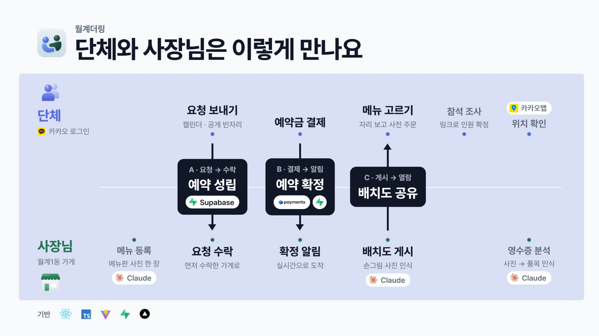
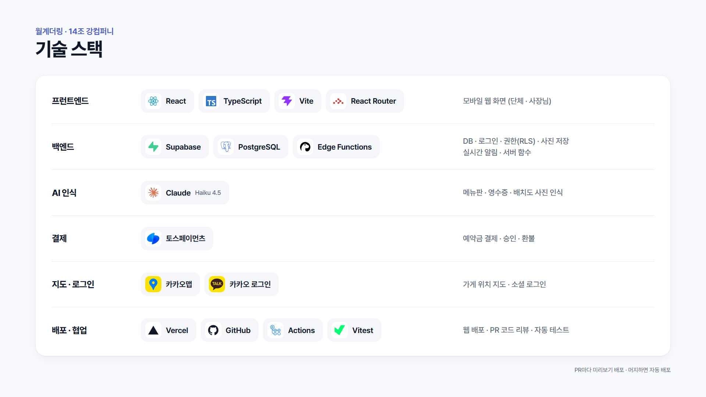

# 월계더링

> 월계1동 단체 모임과 동네 가게를 잇는 **양방향 단체 예약 · 소비 데이터 서비스**

**KW 해커톤 2026 · 14팀 강컴퍼니** — 최종발표 10/9, 전시회 10/11~13

🔗 **서비스 주소: https://wolgyedeoring.vercel.app** (휴대폰 화면 기준)

---

## 한눈에 보기

| | 단체 담당자 | 가게 사장님 |
|---|---|---|
| **예약** | 날짜·인원·1인 예산으로 요청 → 가장 먼저 수락한 가게로 확정, 또는 공개된 빈자리를 골라 바로 예약 | 들어온 요청을 수락(같은 시간대 남은 자리 자동 계산), 빈 날짜·조건을 미리 공개 |
| **확정** | 메뉴 사전 주문(알레르기 메모 포함) → 예약금 결제(토스 테스트) | 사전 주문으로 준비량 확인 |
| **당일까지** | 참석 조사 링크 공유 → 로그인 없이 응답, 마감 시 예약 인원 반영 | 실시간 알림으로 변경 사항 확인 |
| **행사 후** | — | 영수증 사진 → AI 품목 추출 → 확인·보정 후 확정 |
| **운영** | 좌석 배치도 보기 | 메뉴판·배치도 사진 인식, 소비 분석(요일별·메뉴별·자주 찾은 단체), 미충족 수요 |

---

## 문제 정의

월계1동에는 학생회 행사, 동아리 뒤풀이, 종강총회와 주민 모임처럼 반복되는 단체 수요가 있다. 단체는 가게마다 날짜·인원·예산을 전화로 개별 조율해야 하고, 담당자가 바뀌면 예약 경험과 정보가 끊긴다. 가게는 단체 예약의 노쇼와 날짜 쏠림을 예측하기 어렵고, 실제 단체 소비 데이터를 운영에 쓰기 어렵다.

## 해결 방향

단체는 날짜·인원·1인 예산을 담은 예약 요청을 올리고, 조건을 수용하는 가게가 **선착순으로** 수락해 확정한다. 가게가 빈 날짜와 수용 인원을 먼저 여는 제안 방식도 지원한다. 가게가 정해지면 단체는 메뉴를 사전 선택하고 예약금을 결제해 확정하며, 행사 후 영수증을 구조화해 실제 소비 기록으로 남긴다. 메뉴판·영수증 인식은 텍스트 구조화에만 쓰고, 자동 추천·가격 판단·자동 저장은 하지 않으며 사장님 확정을 거친다.

## 타겟

- **단체 담당자**: 학생회, 학과, 동아리 + 방학 수요 보완용 주민 모임·동호회
- **가게 사장님**: 요청 처리, 빈 날짜 제안, 메뉴 관리, 영수증 확정, 소비 분석

---

## 요구사항과 구현 현황

| # | 요구사항 | 구현 | 상태 |
|---|---|---|---|
| 1 | 단체 및 가게 운영 계정 | 이메일 가입·로그인, **카카오 로그인**, 비밀번호 재설정, 역할별 접근 제어(RLS) | ✅ (네이버 로그인은 보류) |
| 2 | 양방향 단체 예약 및 확정 | 요청 → **선착순 1곳 즉시 확정**(동시 수락 서버 처리), 응답 기한·자동 만료, 같은 시간대 수용 인원 검사, 빈자리 일괄 공개(날짜별 최소 인원·1인 금액) | ✅ |
| 3 | 사전 주문 및 추천 메뉴 | 예약별 메뉴 사전 주문, 1인 예산 대비 확인, 알레르기·식이 메모 | ✅ (예산 구간별 추천 메뉴는 보류 [#1](https://github.com/2026-KW-HACKATHON/14_Kangcompany/issues/1)) |
| 4 | 메뉴 및 영수증 인식 확정 | Claude 로 메뉴판·영수증 구조화 → **사장님 확인·보정 후에만 저장**, 원본 사진 미보관 | ✅ |
| 5 | 참석 인원 및 예약 알림 | 로그인 없는 참석 조사 링크, 최소 인원 미달 시 마감 보류, 실시간 알림(Realtime) | ✅ |
| 6 | 가게 예약 및 소비 분석 | 기간별(이번 주·이번 달·최근 3개월) 소비, 요일별 예약, 메뉴별 판매, 자주 찾은 단체, 미충족 수요 | ✅ |
| 7 | 매장 좌석 배치도 | 평면도·손그림·사진 인식(사각형=테이블, 작은 동그라미=좌석) → 끌어서 편집 → 게시 | ✅ |

## 공통 원칙 (프로덕트 정책)

- **이미지 인식 및 데이터 보존**: LLM은 메뉴판·영수증·배치도의 구조화 후보 생성에만 사용. 메뉴 추천·가격 결정·예약 판단·자동 저장에는 쓰지 않음. 사장님이 확인·보정·확정한 것만 저장하고, 확정된 영수증만 소비 분석에 반영. **원본 사진은 저장하지 않음**
- **예약 및 취소 처리**:
  - 가게 응답 기한 — 행사까지 3~7일: **12시간 이내**, 7일 초과: **24시간 이내**. 기한 내 수락 없으면 요청 자동 종료
  - 선착순 확정 — 가장 먼저 수락한 가게만 예약금 결제 대상 전환, 이후 수락 응답은 받지 않음
  - 단체는 **행사 24시간 전까지만** 날짜·인원 수정 가능
  - 동시간대 제한 — 가게는 확정+대기 인원 합이 수용 인원 초과 시 수락 불가. 행사 24시간 이내인 단체는 동시간대 다른 가게 중복 요청 불가
  - 예약금 금액·환불 기준 등 팀 결정 사항은 [결정 기록 #13](https://github.com/2026-KW-HACKATHON/14_Kangcompany/issues/13) 참고

---

## 구조



---

## 기술 스택



| 구분 | 기술 | 쓰임 |
|---|---|---|
| 프런트엔드 | React 19 + Vite + TypeScript + React Router, 순수 CSS (디자인 토큰) | 단체·사장님 화면 39개, 휴대폰 화면 기준 |
| 배포 | Vercel | `main` 머지 시 자동 배포, PR 마다 미리보기 주소 |
| DB·인증·권한 | Supabase (PostgreSQL, Auth, Row Level Security, Realtime) | 마이그레이션 001~013, 상태 전이는 모두 서버 함수(RPC) |
| 서버 로직 | Supabase Edge Functions (Deno) | `extract-menu` `process-receipt` `extract-layout` `toss-payment` |
| AI 인식 | Claude API (이미지 입력 + 도구 호출로 출력 형식 고정) | 메뉴판·영수증: Haiku 4.5, 배치도: `LAYOUT_MODEL` 로 지정 |
| 결제 | 토스페이먼츠 테스트 모드 | 예약금 결제·취소 (키가 없으면 "시연용 결제") |
| 지도·로그인 | 카카오맵 JavaScript SDK, 카카오 로그인 | 가게 위치, 주소 → 좌표 변환, 소셜 로그인 |
| 협업·테스트 | GitHub (PR 리뷰), GitHub Actions, Vitest, PGlite | PR 마다 자동 회귀 테스트, 실제 PostgreSQL 로 SQL 검사 |

---

## 저장소 구성

```
wolgyedeoring-frontend/   React 웹앱 (화면·라우트·API 호출)        → README 참고
wolgyedeoring-backend/    Supabase 마이그레이션·Edge Function·테스트 → README 참고
  supabase/migrations/    001~013 SQL
  supabase/functions/     extract-menu, process-receipt, extract-layout, toss-payment, naver-userinfo(보류)
  scripts/                시연 계정·데이터, 마이그레이션 확인
  docs/API.md             프런트용 호출 방법
docs/
  release/                배포 가이드, Edge Function 점검, 시연 대본, 소셜 로그인 설정
  ui-handoff/             페르소나, 디자인 토큰·컴포넌트, IA·상태 정의, 시안 39개 화면(full-ui)
  planning/               기능명세서·유저플로우 (10/3 기준)
assets/                   로고 시안
```

## 로컬에서 실행

```bash
cd wolgyedeoring-frontend
npm install
cp .env.example .env.local   # Supabase URL·publishable 키, (선택) 토스 클라이언트 키·카카오 JavaScript 키
npm run dev                  # http://localhost:5173
```

```bash
npm run build          # 타입 검사 + 빌드
npm run test:local     # 운영 DB 없이 가짜 API로 화면 회귀 검사 (109개)
cd ../wolgyedeoring-backend && npm test   # 실제 PostgreSQL(PGlite)로 SQL·함수 검사 (48개)
```

- `.env.local` 은 커밋하지 않는다. **service_role 키·토스 시크릿 키는 프런트에 절대 넣지 않는다**
- 카카오맵은 키에 등록된 도메인에서만 열린다. 로컬에서 지도를 보려면 카카오 콘솔의 JavaScript SDK 도메인에 `http://localhost:5173` 을 추가

## 배포·운영

| 할 일 | 문서 |
|---|---|
| 프런트 배포 (Vercel, 환경변수) | [docs/release/01_배포가이드.md](docs/release/01_배포가이드.md) |
| DB 마이그레이션·Edge Function 배포·비밀값 | [wolgyedeoring-backend/README.md](wolgyedeoring-backend/README.md), [docs/release/02_EdgeFunction_점검.md](docs/release/02_EdgeFunction_점검.md) |
| 카카오 로그인 설정 (주의점 포함) | [docs/release/04_소셜로그인_설정.md](docs/release/04_소셜로그인_설정.md) |
| 시연 순서·시연 계정 | [docs/release/03_시연대본.md](docs/release/03_시연대본.md) |

- Vite 환경변수(`VITE_*`)는 빌드할 때 코드에 들어가므로, 바꾼 뒤에는 Vercel 에서 **Redeploy** 해야 반영된다
- AI 모델은 코드 수정 없이 Supabase 비밀값 `MENU_MODEL` · `RECEIPT_MODEL` · `LAYOUT_MODEL` 로 바꿀 수 있다
- 마이그레이션 적용 상태는 `wolgyedeoring-backend/scripts/check_migrations.sql` 로 확인 (ok 열이 모두 true)

---

## 문서

| 위치 | 내용 |
|---|---|
| [`docs/ui-handoff/`](docs/ui-handoff/) | UI 작업 인계 — 페르소나, 디자인 토큰·컴포넌트, IA·콘텐츠 인벤토리·상태 정의, 시안 화면 |
| [`docs/ui-handoff/react-port-diff.md`](docs/ui-handoff/react-port-diff.md) | 시안 ↔ React 화면별 차이와 남은 팀 결정 |
| [`docs/release/`](docs/release/) | 배포·운영·시연 |
| [`docs/planning/`](docs/planning/) | 기능명세서·유저플로우 |
| [`wolgyedeoring-backend/docs/API.md`](wolgyedeoring-backend/docs/API.md) | API 문서 |
| [결정 기록 #13](https://github.com/2026-KW-HACKATHON/14_Kangcompany/issues/13) | 지금까지 확정된 결정 |

## 협업 규칙

작업 전에 **[CONTRIBUTING.md](CONTRIBUTING.md)** 를 읽어주세요. 요약:

- **브랜치**: `<타입>/<영역>-<설명>` 브랜치 → PR → 머지 (예: `feat/fe-login`). PR 마다 Vercel 미리보기 주소가 댓글로 달린다
- **커밋**: `<타입>(<영역>): <한글 요약>` (예: `feat(fe): 예약 요청 작성 화면 추가`)
  - 타입: `feat` `fix` `design` `refactor` `docs` `test` `chore`
  - 템플릿 적용: `git config commit.template .gitmessage`
- **이슈**: 팀 결정이 필요한 사항은 `TBD` 라벨 이슈로 관리 → [열린 TBD 이슈](https://github.com/2026-KW-HACKATHON/14_Kangcompany/issues?q=is%3Aopen+label%3ATBD)
- **API 변경 시** `wolgyedeoring-backend/docs/API.md` 를 같은 PR에서 수정

---

## 팀 강컴퍼니

| 이름 | 역할 |
|---|---|
| 이원우 | 프론트엔드, UI/UX |
| 정윤철 | 백엔드 |
| 강현 | 프론트엔드, UI |
| 박민수 | 자료조사, 데이터 수집, 기획문서 작성 및 총괄 |
