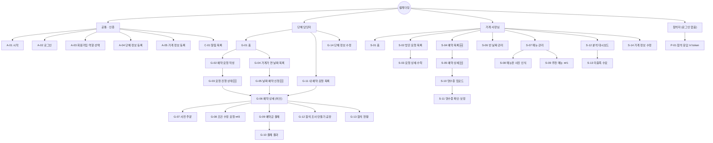

# 월계더링 IA (정보 구조)

| | |
|---|---|
| 버전 | v0.1 (초안) |
| 작성일 | 2026-10-03 |
| 작성 | FE 이원우 |
| 기준 문서 | `docs/planning/유저플로우_2026-10-03.md`, `docs/planning/기능명세서_2026-10-03.md`, BE 마이그레이션 001~007 |
| 짝 문서 | [콘텐츠 인벤토리](content-inventory.md) |

> **유저플로우가 아직 확정되지 않았다.** 이 문서는 유저플로우가 바뀌어도 따라갈 수 있도록 다음 규칙을 따른다.
> - 화면마다 **고정 ID**(`G-03` 등)를 쓴다. 화면이 없어지면 ID를 지우지 않고 `폐기`로 표시하고, 새 화면은 다음 번호를 쓴다.
> - 각 화면에 **유저플로우 노드 번호**(`n18` 등)를 적어 둔다. 유저플로우가 바뀌면 이 열로 영향 받는 화면을 찾는다.
> - 결정 대기 중인 화면은 **상태** 열에 관련 이슈 번호를 적는다.

---

## 0. 변경 이력

| 버전 | 날짜 | 내용 |
|---|---|---|
| v0.1 | 10-03 | 초안. 유저플로우 대비 선착순 확정 반영(n20~n22 대체), 유저플로우에 없던 화면 6개 추가 |

---

## 1. 전제와 범위

- **서비스 형태**: 모바일 웹 우선의 웹앱 (React + Vite). 기준 폭 375px
- **역할**: 단체 담당자(`group`), 가게 사장님(`owner`), 참석자(로그인 없음). 운영자는 [#4](https://github.com/2026-KW-HACKATHON/14_Kangcompany/issues/4) 결정 대기
- **매칭**: 단체가 요청 → 조건을 받을 수 있는 가게 중 **가장 먼저 수락한 가게로 확정**(결제 대기). 단체가 가게를 고르는 단계는 없다
- **범위 밖**: 좌석 배치도([#5](https://github.com/2026-KW-HACKATHON/14_Kangcompany/issues/5)), 운영자 화면([#4](https://github.com/2026-KW-HACKATHON/14_Kangcompany/issues/4))

### 상태 표기

| 표기 | 의미 |
|---|---|
| ✅ 확정 | 유저플로우와 API 모두 있음 |
| 🆕 추가 | 유저플로우에 없지만 API 흐름상 필요해 추가한 화면 (기획 확인 필요) |
| 🔄 변경 | 유저플로우와 다르게 구성 (선착순 반영 등) |
| ⏸ TBD | 팀 결정 대기 (이슈 번호) |
| 🗑 폐기 | 더 이상 쓰지 않음 (ID 재사용 금지) |

---

## 2. 사이트맵



---

## 3. 내비게이션 (제안)

모바일 웹 하단 탭 + 상단 알림 아이콘. **역할별로 탭 구성이 다르다.**

| 역할 | 탭 1 | 탭 2 | 탭 3 | 탭 4 | 상단 |
|---|---|---|---|---|---|
| 단체 | 홈 `G-01` | 예약 `G-11` | 가게 날짜 `G-04` | 내 정보 `G-14` | 🔔 알림 `C-01` |
| 사장님 | 홈 `S-01` | 요청·예약 `S-02`/`S-04` (상단 세그먼트) | 메뉴 `S-07` | 분석 `S-12` | 🔔 알림 `C-01`, ⚙ 가게 정보 `S-14` |
| 참석자 | 탭 없음 (단일 화면) | | | | |

- 단체의 주요 행동 "예약 요청하기"는 홈 `G-01` 의 주요 버튼(CTA)으로 둔다. 탭으로 두지 않는 이유: 요청은 보통 한 학기에 몇 번뿐이라 상시 탭으로 둘 만큼 자주 쓰지 않는다.
- 사장님의 빈 날짜 관리 `S-06` 은 홈 `S-01` 의 바로가기와 요청·예약 탭 안에서 들어간다.

---

## 4. 화면 목록

### 4-1. 공통 · 인증

| ID | 화면 | 플로우 노드 | 진입 | 나감 | 상태 |
|---|---|---|---|---|---|
| A-01 | 시작 (온보딩) | n1, n2, n3 | 앱 최초 접속, 로그아웃 | A-02, A-03 | ✅ |
| A-02 | 로그인 | n4, n11, n12 | A-01 | 역할별 홈 (G-01 / S-01) | ✅ |
| A-03 | 회원가입·역할 선택 | n5, n6, n7, n8 | A-01 | A-04 또는 A-05 | ✅ |
| A-04 | 단체 정보 등록 | n9 | A-03 (단체) | G-01 | ✅ |
| A-05 | 가게 정보 등록 | n10 | A-03 (사장님) | S-01 (이후 메뉴 등록 안내) | ✅ |
| C-01 | 알림 목록 | n16, n17, n47 | 상단 🔔 | 알림 종류별 화면 (매핑은 콘텐츠 인벤토리 C-01) | 🔄 n17 알림 상세는 별도 화면 없이 관련 화면으로 바로 이동 |

### 4-2. 단체 담당자

| ID | 화면 | 플로우 노드 | 진입 | 나감 | 상태 |
|---|---|---|---|---|---|
| G-01 | 홈 | n14, n15 | 로그인, 하단 탭 | G-02, G-03, G-06, G-04 | ✅ |
| G-02 | 예약 요청 작성 | n18, n19 | G-01 CTA | G-03 | ✅ |
| G-03 | 요청 진행 상태 | n20~n22 대체 | G-02 제출, G-11, 알림 | 수락 시 G-06 / 만료 시 G-02 재작성 | 🆕🔄 선착순: 가게 목록·선택 대신 **응답 대기 → 확정** 표시 |
| G-04 | 가게가 연 날짜 목록 | n37, n38 | 하단 탭, G-01 | G-05 | ✅ |
| G-05 | 날짜 예약 신청 | n39 | G-04 | G-06 | 🆕 인원·행사 종류·예산 입력 (슬롯 예약에 필요) |
| G-06 | 예약 상세 (허브) | n23, n24 | G-03, G-05, G-11, 알림 | G-07, G-08, G-09, G-12, G-13, 취소 | 🔄 상태별로 보이는 행동이 다름 |
| G-07 | 사전 주문 | n27~n31 | G-06 | G-06 | ✅ |
| G-08 | 조건 수정 요청 | n25, n26 | G-06 | G-06 | ⏸ [#3](https://github.com/2026-KW-HACKATHON/14_Kangcompany/issues/3) 주체(단체/사장님) 결정 대기. 현재 API는 단체 요청형 |
| G-09 | 예약금 결제 | n32 | G-06 | 토스 결제창 → G-10 | ✅ |
| G-10 | 결제 결과 (성공/실패) | n33, n34 | 토스 successUrl / failUrl | G-06, G-12 | 🔄 **실패 분기 추가** (유저플로우에 없음) |
| G-11 | 내 예약·요청 목록 | n35, n36 | 하단 탭 | G-03, G-06 | 🔄 진행 중인 **요청**도 함께 표시 (세그먼트: 진행 중 / 지난 예약) |
| G-12 | 참석 조사 만들기·공유 | n40, n41 | G-06, G-10 | 공유(링크 복사·공유 시트), G-13 | ✅ |
| G-13 | 참석 현황 | n44, n45 | G-06, G-12 | G-06 | 🔄 마감·장난 응답 삭제 행동 추가 |
| G-14 | 단체 정보 수정 | n76, n77 | 하단 탭 | G-01 | ✅ 로그아웃도 여기 |

### 4-3. 가게 사장님

| ID | 화면 | 플로우 노드 | 진입 | 나감 | 상태 |
|---|---|---|---|---|---|
| S-01 | 홈 | n46 | 로그인, 하단 탭 | S-02, S-05, S-06, S-11 | ✅ 오늘 예약·새 요청·확인 필요 영수증 요약 |
| S-02 | 받은 요청 목록 | n47 | 하단 탭, 알림 | S-03 | ✅ |
| S-03 | 요청 상세·수락/거절 | n48~n51 | S-02, 알림 | 수락 시 S-05 / 거절 시 S-02 | 🔄 수락 = 즉시 확정. 예약금 입력 포함. n51(조건 수정 제안)은 ⏸ [#3](https://github.com/2026-KW-HACKATHON/14_Kangcompany/issues/3) |
| S-04 | 예약 목록 | — | 하단 탭(세그먼트) | S-05 | 🆕 유저플로우에 없음. 확정 예약을 볼 곳이 필요 |
| S-05 | 예약 상세 | — | S-04, S-03, 알림 | S-10, 조건 수정 응답, 완료·노쇼 처리, 취소 | 🆕 영수증 업로드 전 "행사 완료" 처리 필요 |
| S-06 | 빈 날짜 관리 | n52, n53 | S-01 | S-01 | 🔄 등록뿐 아니라 내가 연 날짜 목록·닫기 포함 |
| S-07 | 메뉴 관리 | n54, n55, n56 | 하단 탭 | S-08, S-09 | ✅ |
| S-08 | 메뉴판 사진 인식·확인 | n57, n58, n59 | S-07 | S-07 | 🔄 "메뉴판에 없는 기존 메뉴 판매 중지" 확인 단계 추가 |
| S-09 | 추천 메뉴 등록 | n60, n61 | S-07 | S-07 | ⏸ [#1](https://github.com/2026-KW-HACKATHON/14_Kangcompany/issues/1) API 없음 |
| S-10 | 영수증 업로드 | n62 | S-05 | S-11 | ✅ |
| S-11 | 영수증 확인·보정 | n63, n64, n65 | S-10, S-01, 알림 | S-05 | 🔄 결과 3가지(통과/확인 필요/실패) 분기 |
| S-12 | 분석 대시보드 | n66~n69 | 하단 탭 | S-13 | ✅ |
| S-13 | 미충족 수요 | n70 | S-12 | S-12 | ✅ (운영자 화면 n71~n73과의 관계는 ⏸ [#4](https://github.com/2026-KW-HACKATHON/14_Kangcompany/issues/4)) |
| S-14 | 가게 정보 수정 | n74, n75 | 상단 ⚙ | S-01 | ✅ 로그아웃도 여기 |

### 4-4. 참석자 (로그인 없음)

| ID | 화면 | 플로우 노드 | 진입 | 나감 | 상태 |
|---|---|---|---|---|---|
| P-01 | 참석 응답 | n42, n43 | 공유 링크 `/r/:token` | 같은 화면에서 완료 표시 | ✅ |

### 4-5. 보류·폐기

| ID | 화면 | 플로우 노드 | 상태 |
|---|---|---|---|
| — | 수락 가게 목록·가게 선택 | n20, n21, n22 | 🗑 선착순 확정으로 G-03에 통합 |
| — | 알림 상세 | n17 | 🗑 알림을 누르면 관련 화면으로 바로 이동 |
| O-01 | 운영자 홈 | n71 | ⏸ [#4](https://github.com/2026-KW-HACKATHON/14_Kangcompany/issues/4) |
| O-02 | 운영자 미충족 수요 조회 | n72, n73 | ⏸ [#4](https://github.com/2026-KW-HACKATHON/14_Kangcompany/issues/4) |
| — | 좌석 배치도 | (없음) | ⏸ [#5](https://github.com/2026-KW-HACKATHON/14_Kangcompany/issues/5) |

---

## 5. 핵심 흐름 (선착순 반영)

### 단체 요청 → 확정

```
G-02 요청 작성 → G-03 응답 대기 (응답 기한 카운트다운)
   ├─ 가게 수락 → 알림 → G-06 예약 상세 (결제 대기)
   │     → G-07 사전 주문 (선택) → G-09 결제 → G-10 성공 → G-06 (확정) → G-12 참석 조사
   │                                        └ G-10 실패 → 다시 결제 / G-06
   └─ 기한 내 수락 없음 → G-03 만료 → G-02 조건 바꿔 다시 요청
```

### 가게가 연 날짜로 예약

```
G-04 날짜 목록 → G-05 신청 (인원·행사·예산, 사전 주문 선택) → G-06 (결제 대기) → G-09 → G-10
```

### 사장님 요청 처리 → 행사 후

```
S-02 받은 요청 → S-03 수락(예약금 입력) → S-05 예약 상세 (결제 대기 → 확정)
행사 당일 이후: S-05 완료 처리 (또는 노쇼) → S-10 영수증 업로드 → S-11 확인·보정 → 통계 반영
```

---

## 6. 유저플로우에 반영 요청 (기획 담당)

유저플로우를 다음에 고칠 때 반영이 필요한 항목. 반영되면 위 표의 🆕/🔄 표시를 ✅로 바꾼다.

1. n20~n22(수락 가게 목록·선택) → "응답 대기 / 확정 / 만료" 상태 화면으로 교체 (G-03)
2. 결제 실패 분기 (G-10)
3. 사장님 예약 목록·예약 상세 (S-04, S-05), 행사 완료·노쇼 처리
4. 예약 취소 (단체 G-06, 사장님 S-05)
5. 영수증 결과 분기: 확인 필요 / 인식 실패 (S-11)
6. 참석 조사 마감·응답 삭제 (G-13)
7. 메뉴판 인식 후 "판매 중지할 메뉴" 확인 (S-08)
8. 가게가 연 날짜 예약 시 인원·행사 입력 단계 (G-05)
