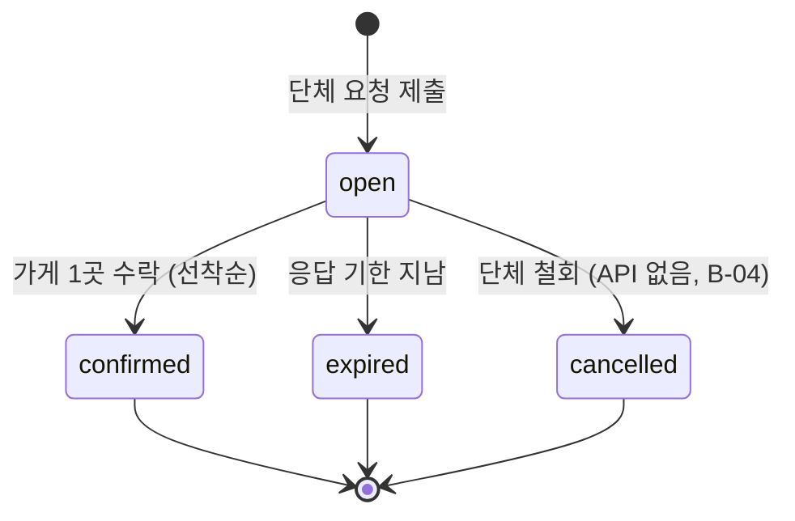
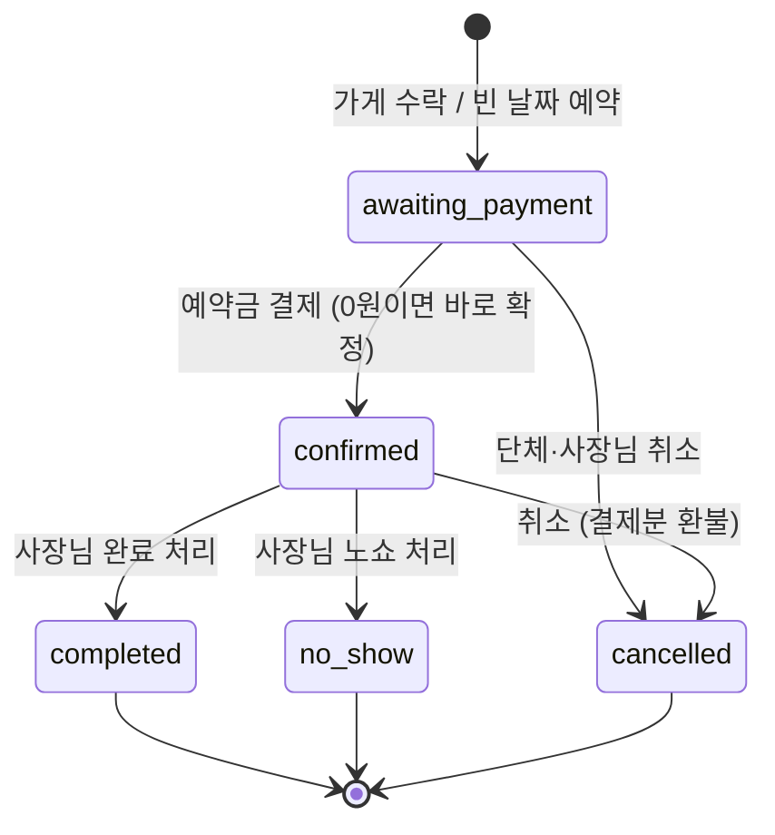
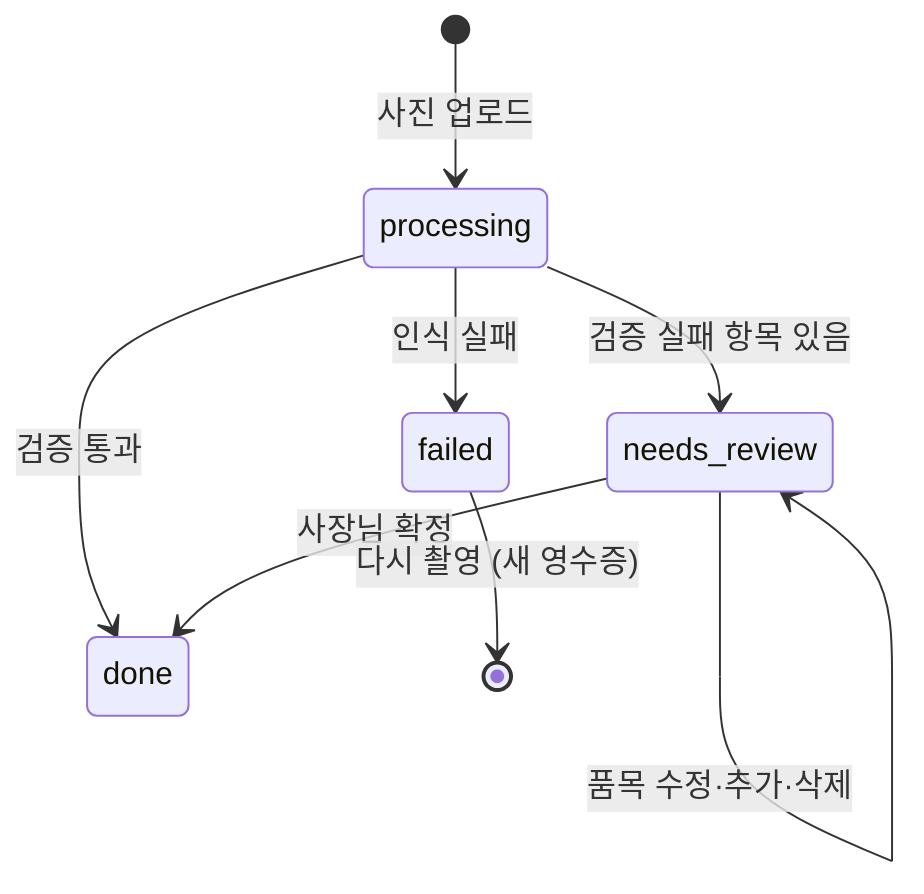

# 월계더링 상태 정의도

| | |
|---|---|
| 버전 | v0.1 (초안) |
| 작성일 | 2026-10-03 |
| 작성 | FE 이원우 |
| 짝 문서 | [IA](IA.md), [콘텐츠 인벤토리](content-inventory.md) — 화면 ID 동일 |
| 기준 | BE 마이그레이션 001~007 (상태값·전이 조건은 DB 함수에서 확인) |

BE 상태값을 **화면에서 부르는 이름(라벨), 배지 색, 그 상태에서 할 수 있는 행동**으로 정리한다.
BE 담당자는 각 표의 **전이(누가·무엇으로)** 열이 실제 구현과 맞는지, [10. 규칙 공백](#10-규칙-공백-be팀-확인)을 확인해 주면 된다.

---

## 0. 원칙

1. **"확정"은 예약금 결제가 끝난 예약에만 쓴다.** 가게가 수락했지만 결제 전이면 "결제 대기"로 부른다. (기능명세서 2장 수용 기준 4와 일치. BE 알림 문구 "예약이 확정되었습니다 (결제 대기)"는 수정 요청 → [10번](#10-규칙-공백-be팀-확인) R-01)
2. **같은 상태는 단체와 사장님이 같은 이름으로 부른다.** 역할마다 다른 건 "다음에 할 일" 문구뿐이다.
3. **배지 색은 의미로만 쓴다.** 디자인 토큰에서 아래 5가지 톤에 색을 매핑한다.

| 톤 | 의미 | 예 |
|---|---|---|
| `neutral` | 기다리는 중, 사용자 행동 불필요 | 응답 대기 |
| `warning` | **사용자가 행동해야 함** | 결제 대기, 확인 필요 |
| `success` | 정상 완료 | 확정, 완료 |
| `danger` | 실패·문제 | 노쇼, 인식 실패 |
| `muted` | 끝났고 더 할 일 없음 | 취소, 만료, 마감 |

---

## 1. 예약 요청 (`requests.status`)

| 코드 | 라벨 | 톤 | 의미 | 단체에게 보이는 다음 할 일 | 사장님 화면 |
|---|---|---|---|---|---|
| `open` | 응답 대기 | `neutral` | 조건에 맞는 가게들이 보고 있음 | "응답 기한까지 기다려 주세요 · N시간 남음" | S-02에 표시, 수락/거절 가능 |
| `confirmed` | 가게 확정 | `success` | 한 가게가 수락해 예약이 생성됨 | "예약 상세에서 결제를 진행하세요" → G-06 | 수락한 가게: S-05 / 다른 가게: "마감" |
| `expired` | 만료 | `muted` | 기한 내 수락한 가게 없음 | "조건을 바꿔 다시 요청해 보세요" → G-02 | 목록에서 사라짐 |
| `cancelled` | 취소 | `muted` | 단체가 철회 | — | 목록에서 사라짐 |

**전이**

| 전이 | 누가 | 무엇으로 | 조건 |
|---|---|---|---|
| → `open` | 단체 | `requests.insert` | 행사 24시간 이내면 같은 시간대 다른 요청·예약이 없어야 함. 응답 기한 자동 계산 |
| `open` → `confirmed` | 사장님 | `respond_to_request(accept)` | 기한 전, 최대 인원 이내, 같은 시간대 합산 인원 이내. 동시 수락 시 먼저 처리된 1건만 |
| `open` → `expired` | 시스템 | `expire_old_requests` | `response_deadline` 지남 |

**가게별 응답 (`request_responses.status`)**: 사장님 S-02 목록의 "내 응답" 표시용

| 코드 | 라벨 | 비고 |
|---|---|---|
| (행 없음) | 새 요청 | 아직 열어보지 않음/응답 안 함 |
| `declined` | 거절함 | |
| `accepted` | 수락함 | 이 가게로 확정 |
| `pending`, `modify_requested` | — | 선착순 구조에서 쓰이지 않음 → R-04 |

---

## 2. 예약 (`reservations.status`)

| 코드 | 라벨 | 톤 | 단체 다음 할 일 | 사장님 다음 할 일 |
|---|---|---|---|---|
| `awaiting_payment` | 결제 대기 | `warning` | "예약금을 결제해야 확정돼요" + 사전 주문 권유 | "단체의 결제를 기다리는 중" |
| `confirmed` | 확정 | `success` | 참석 조사 만들기 (없을 때) | 사전 주문 확인 → 행사 후 완료 처리 |
| `completed` | 완료 | `success` | — | 영수증 등록 (없을 때) |
| `no_show` | 노쇼 | `danger` | — | — |
| `cancelled` | 취소됨 | `muted` | 환불 상태 확인 | — |

### 2-1. 행동 매트릭스 (B-09 플래그의 기준)

✅ 가능 · — 불가 · 단 = 단체, 사 = 사장님

| 행동 | API | 결제 대기 | 확정 | 완료 | 노쇼 | 취소 | 추가 조건 |
|---|---|---|---|---|---|---|---|
| 예약금 결제 (단) | `prepare_deposit_payment` → 토스 | ✅ | — | — | — | — | 조건 수정 응답 대기(`pending`) 중이면 불가. 0원이면 `confirm_zero_deposit` |
| 사전 주문 수정 (단) | `set_preorder` | ✅ | ✅ | — | — | — | 확정 후에는 **행사 24시간 전까지** (`editable`) |
| 조건 수정 요청 (단) | `request_modification` | ✅ | — | — | — | — | 1회, 행사 24시간 전까지. 빈 날짜 예약은 인원만 ⏸ #3 |
| 조건 수정 응답 (사) | `respond_modification` | ✅ | — | — | — | — | `modify_status = pending` 일 때 |
| 참석 조사 생성·응답 수집 (단) | `create_rsvp` | ✅ | ✅ | — | — | — | 조사가 마감되지 않았을 때 |
| 취소 (단·사) | `cancel_reservation` / `toss-payment(cancel)` | ✅ | ✅ | — | — | — | 토스 결제분은 `toss-payment(cancel)`만. **시간 제한 없음** → R-02 |
| 완료 / 노쇼 처리 (사) | `finish_reservation` | — | ✅ | — | — | — | **행사 시작 전에도 가능** → R-03 |
| 영수증 등록 (사) | `process-receipt` | — | ✅ | ✅ | — | — | |

### 2-2. 조건 수정 하위 상태 (`reservations.modify_status`) ⏸ #3

| 코드 | 라벨 | 톤 | 표시 |
|---|---|---|---|
| `null` | — | — | 단체: "조건 수정 요청 (1회 가능)" 버튼 |
| `pending` | 수정 요청 중 | `warning` (사장님) / `neutral` (단체) | 단체: 결제 버튼 비활성 + "가게 응답 후 결제할 수 있어요" |
| `accepted` | 수정 반영됨 | `success` | 바뀐 날짜·인원 강조 1회 |
| `rejected` | 수정 거절됨 | `muted` | "기존 조건으로 결제하거나 취소할 수 있어요" |

---

## 3. 결제 (`payments.status`)

예약 상세의 "예약금" 영역에만 표시. 한 예약에 결제 시도가 여러 행일 수 있으며 **가장 최근 행**을 보여준다.

| 코드 | 라벨 | 톤 | 표시 |
|---|---|---|---|
| (행 없음) | 미결제 | `warning` | 결제 버튼 |
| `pending` | 결제 진행 중 | `neutral` | 결제창을 닫았으면 "다시 결제" 버튼 (이전 주문은 자동 무효) |
| `paid` | 결제 완료 | `success` | 금액, 결제 수단, 토스 영수증 링크 |
| `failed` | 결제 실패 | `danger` | 실패 사유 + 다시 결제 |
| `refunded` | 환불 완료 | `muted` | 환불 금액 |

---

## 4. 영수증 (`receipts.status`)

| 코드 | 라벨 | 톤 | 사장님 다음 할 일 | 통계 반영 |
|---|---|---|---|---|
| `processing` | 인식 중 | `neutral` | 로딩 (수 초) | — |
| `needs_review` | 확인 필요 | `warning` | 빨간 품목 수정 → 확정. 사유는 `notes`, 품목별 `validation_error` | — |
| `done` | 확정 | `success` | — | ✅ |
| `failed` | 인식 실패 | `danger` | "밝은 곳에서 영수증 전체가 나오게 다시 찍어주세요" | — |

**품목 단위**: `validation_error` 있음 → `danger` 표시, 메뉴 미매칭(`menu_id = null`) → `warning` + 메뉴 선택 드롭다운. 둘 중 하나라도 남아 있으면 확정 버튼 비활성 (BE도 거절).

---

## 5. 빈 날짜 (`slots.status`)

| 코드 | 사장님 라벨 | 단체 라벨 | 톤 | 비고 |
|---|---|---|---|---|
| `open` | 열림 | 예약 가능 | `success` | 단체 G-04에 표시 (시작 시각이 지나지 않은 것만) |
| `booked` | 예약됨 | (목록에서 숨김) | `neutral` | 예약이 취소되면 자동으로 `open` 복귀 (행사 전일 때) |
| `closed` | 닫음 | (숨김) | `muted` | 닫는 방법 문서 없음 → B-07 |

---

## 6. 참석 조사 (`rsvps`)

| 상태 | 판단 기준 | 라벨 | 톤 | 참석자(P-01) 화면 |
|---|---|---|---|---|
| 응답 받는 중 | `is_closed = false` + 마감 전 + 예약이 결제 대기·확정 | 응답 받는 중 · N명 참석 | `success` | 응답 폼 |
| 마감 | `is_closed = true` 또는 마감 시각 지남 | 마감 | `muted` | "응답이 마감되었어요" + 최종 인원 |
| 행사 취소 | 예약 `cancelled` | 취소된 행사 | `muted` | "취소된 행사예요" |

참석 응답 거절 사유 (정원 초과 등)는 `error.message` 를 그대로 보여준다.

---

## 7. 메뉴

| 대상 | 코드 | 라벨 | 톤 | 표시 |
|---|---|---|---|---|
| 메뉴 | `is_active = true` | 판매 중 | — (기본) | |
| 메뉴 | `is_active = false` | 판매 중지 | `muted` | 사전 주문 목록에서 숨김 |
| 메뉴판 인식 결과 | `new` | 새 메뉴 | `success` | |
| 〃 | `price_changed` | 가격 변경 | `warning` | "15,000 → 16,000" |
| 〃 | `same` | 변경 없음 | `muted` | 기본 접힘 |
| 〃 | `reactivate` | 다시 판매 | `success` | |
| 〃 | `confidence = low` 또는 `price = null` | 확인 필요 | `warning` | 입력칸 강조 |

---

## 8. 시간 기반 표시 규칙

| 규칙 | 기준 | 화면 | 표시 방식 |
|---|---|---|---|
| 가게 응답 기한 | `requests.response_deadline` | G-03, S-02, S-03 | 남은 시간 카운트다운. **3시간 이하 `warning`** |
| 사전 주문·조건 수정 마감 | 행사 시작 24시간 전 | G-06, G-07 | 마감 전: "10/13 19:00까지 수정 가능" / 이후: 비활성 + 사유 |
| 참석 조사 마감 | `rsvps.deadline` (기본: 행사 24시간 전) | G-12, G-13, P-01 | 마감 시각 표시 |
| 행사 지남 + 확정 | `start_at < now` + `confirmed` | S-01, S-05 | 사장님에게 "완료 처리가 필요해요" `warning` |

모든 시각은 한국 시간(KST)으로 `10/13(월) 19:00` 형식.

---

## 9. 화면 공통 상태 (문구 초안)

| 화면 | 빈 상태 | 다음 행동 |
|---|---|---|
| G-01 홈 (첫 사용) | "아직 예약이 없어요. 행사 날짜와 인원만 알려주면 가게가 먼저 연락해요." | 예약 요청하기 |
| G-11 내 예약 | "진행 중인 예약이 없어요" | 예약 요청하기 / 가게 날짜 보기 |
| G-04 가게 날짜 | "지금 열린 날짜가 없어요. 원하는 날짜로 요청해 보세요." | 예약 요청하기 |
| S-02 받은 요청 | "새 요청이 없어요. 한산한 날짜를 먼저 열어두면 단체가 찾아와요." | 빈 날짜 열기 |
| S-04 예약 목록 | "예정된 예약이 없어요" | — |
| S-07 메뉴 (첫 사용) | "메뉴판 사진 한 장이면 메뉴가 등록돼요" | 메뉴판 찍기 / 직접 입력 |
| S-12 분석 | "확정된 영수증이 쌓이면 분석이 보여요" | — |
| C-01 알림 | "새 알림이 없어요" | — |

| 공통 | 처리 |
|---|---|
| 로딩 | 목록·카드는 스켈레톤, 버튼 동작은 버튼 안 스피너 + 중복 클릭 방지 |
| 오류 | `error.message`(한글)를 그대로 표시 + "다시 시도". 네트워크 오류는 "연결을 확인해 주세요" |
| 권한 없음 (`42501`) | "볼 수 없는 예약이에요" + 홈으로 |
| 동시성 거절 ("이미 마감된 요청") | 토스트 + 목록 새로고침 (선착순에서 늦은 가게) |

---

## 10. 규칙 공백 (BE·팀 확인)

| ID | 내용 | 제안 | 담당 |
|---|---|---|---|
| R-01 | 가게 수락 시 단체 알림 문구가 "예약이 확정되었습니다 (결제 대기)" | "OO가게가 수락했어요. 예약금을 결제하면 확정돼요" | BE (문구만) |
| R-02 | 취소에 시간 제한·위약 규정이 없음. 행사 직전 취소도 전액 환불 | 정책 결정 필요 | 팀 [#6](https://github.com/2026-KW-HACKATHON/14_Kangcompany/issues/6) |
| R-03 | `finish_reservation` 이 행사 시작 **전**에도 완료·노쇼 처리 가능 | `start_at <= now()` 조건 추가 | BE |
| R-04 | `request_responses.status` 의 `pending`, `modify_requested` 가 선착순 이후 쓰이지 않음 | 유지 시 FE는 무시. 정리 여부는 BE 판단 | BE |
| R-05 | 단체가 응답 대기 중 요청을 철회할 수 없음 | `cancel_request` RPC (= B-04) | BE |
| R-06 | 상태별 가능한 행동을 FE가 2-1 매트릭스로 복제 | 예약 조회 시 `can_*` 플래그 제공 (= B-09) | BE |

