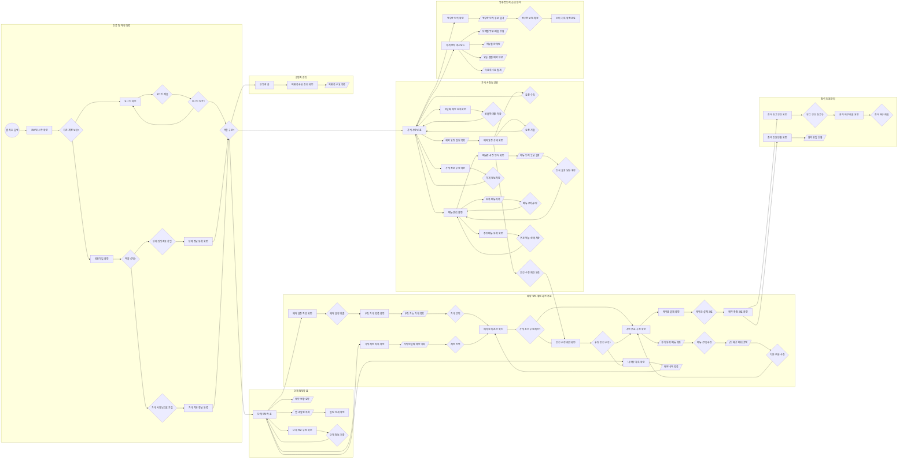

```mermaid
flowchart LR

  subgraph s1 ["인증 및 계정 등록"]
    n1(("앱 최초 실행"))
    n2["온보딩/시작 화면"]
    n3{"기존 계정 보유?"}
    n4["로그인 화면"]
    n5["회원가입 화면"]
    n6{"역할 선택?"}
    n7{"단체 담당자로 가입"}
    n8{"가게 사장님으로 가입"}
    n9["단체 정보 등록 화면"]
    n10["가게 기본 정보 등록"]
    n11{"로그인 제출"}
    n12{"로그인 성공?"}
    n13{"역할 구분?"}
  end

  subgraph s2 ["단체 담당자 홈"]
    n14["단체 담당자 홈"]
    n15[/"예약 현황 요약"/]
    n16[/"앱 내 알림 목록"/]
    n17["알림 상세 화면"]
    n76["단체 정보 수정 화면"]
    n77{"단체 정보 저장"}
  end

  subgraph s3 ["예약 요청·확정·사전 주문"]
    n18["예약 요청 작성 화면"]
    n19{"예약 요청 제출"}
    n20["수락 가게 목록 화면"]
    n21[/"수락 가능 가게 목록"/]
    n22{"가게 선택"}
    n23["예약 상세/조건 확인"]
    n24{"가게 조건 수정 제안?"}
    n25["조건 수정 제안 화면"]
    n26{"수정 조건 수락?"}
    n27["사전 주문 구성 화면"]
    n28[/"가게 등록 메뉴 목록"/]
    n29{"메뉴 선택/구성"}
    n30[/"1인 예산 대비 금액"/]
    n31{"기본 주문 수정"}
    n32["예약금 결제 화면"]
    n33{"예약금 결제 완료"}
    n34["예약 확정 완료 화면"]
    n35["내 예약 목록 화면"]
    n36[/"예약 내역 목록"/]
    n37["가게 제안 목록 화면"]
    n38[/"가게 빈날짜 제안 목록"/]
    n39{"제안 선택"}
  end

  subgraph s4 ["참석 인원 관리"]
    n40["참석 링크 생성 화면"]
    n41{"링크 생성 및 공유"}
    n42["참석 여부 제출 화면"]
    n43{"참석 여부 제출"}
    n44["참석 인원 현황 화면"]
    n45[/"참석 응답 현황"/]
  end

  subgraph s5 ["가게 사장님 운영"]
    n46["가게 사장님 홈"]
    n47[/"예약 요청 알림 목록"/]
    n48["예약 요청 상세 화면"]
    n49{"요청 수락"}
    n50{"요청 거절"}
    n51{"조건 수정 제안 등록"}
    n52["빈날짜 제안 등록 화면"]
    n53{"빈날짜 제안 저장"}
    n54["메뉴 관리 화면"]
    n55[/"등록 메뉴 목록"/]
    n56{"메뉴 추가/수정"}
    n57["메뉴판 사진 인식 화면"]
    n58[/"메뉴 인식 후보 결과"/]
    n59{"인식 결과 보정·확정"}
    n60["추천 메뉴 등록 화면"]
    n61{"추천 메뉴 선택 저장"}
    n74["가게 정보 수정 화면"]
    n75{"가게 정보 저장"}
  end

  subgraph s6 ["영수증 인식·소비 분석"]
    n62["영수증 인식 화면"]
    n63[/"영수증 인식 후보 결과"/]
    n64{"영수증 보정·확정"}
    n65["소비 기록 확정 완료"]
    n66["가게 분석 대시보드"]
    n67[/"단체별 방문·매출 현황"/]
    n68[/"메뉴별 판매량"/]
    n69[/"요일·월별 예약 분포"/]
    n70[/"미충족 수요 집계"/]
  end

  subgraph s7 ["운영자 관리"]
    n71["운영자 홈"]
    n72["미충족 수요 조회 화면"]
    n73[/"미충족 수요 목록"/]
  end

  n1 --> n2
  n2 --> n3
  n3 --> n4
  n3 --> n5
  n5 --> n6
  n6 --> n7
  n6 --> n8
  n7 --> n9
  n8 --> n10
  n4 --> n11
  n11 --> n12
  n12 --> n4
  n12 --> n13
  n9 --> n13
  n10 --> n13
  n13 --> n14
  n13 --> n46
  n13 --> n71
  n14 --> n15
  n14 --> n16
  n16 --> n17
  n14 --> n18
  n14 --> n35
  n14 --> n37
  n14 --> n76
  n18 --> n19
  n19 --> n20
  n20 --> n21
  n21 --> n22
  n22 --> n23
  n23 --> n24
  n24 --> n25
  n24 --> n27
  n25 --> n26
  n26 --> n27
  n26 --> n35
  n27 --> n28
  n28 --> n29
  n29 --> n30
  n30 --> n31
  n31 --> n27
  n27 --> n32
  n32 --> n33
  n33 --> n34
  n34 --> n40
  n35 --> n36
  n36 --> n23
  n37 --> n38
  n38 --> n39
  n39 --> n23
  n40 --> n41
  n42 --> n43
  n34 --> n44
  n44 --> n45
  n41 --> n42
  n76 --> n77
  n77 --> n14
  n46 --> n47
  n47 --> n48
  n48 --> n49
  n48 --> n50
  n48 --> n51
  n49 --> n46
  n50 --> n46
  n51 --> n25
  n46 --> n52
  n52 --> n53
  n53 --> n46
  n46 --> n54
  n54 --> n55
  n55 --> n56
  n56 --> n54
  n54 --> n57
  n57 --> n58
  n58 --> n59
  n59 --> n54
  n54 --> n60
  n60 --> n61
  n61 --> n54
  n46 --> n74
  n74 --> n75
  n75 --> n46
  n46 --> n62
  n62 --> n63
  n63 --> n64
  n64 --> n65
  n46 --> n66
  n66 --> n67
  n66 --> n68
  n66 --> n69
  n66 --> n70
  n71 --> n72
  n72 --> n73
```
