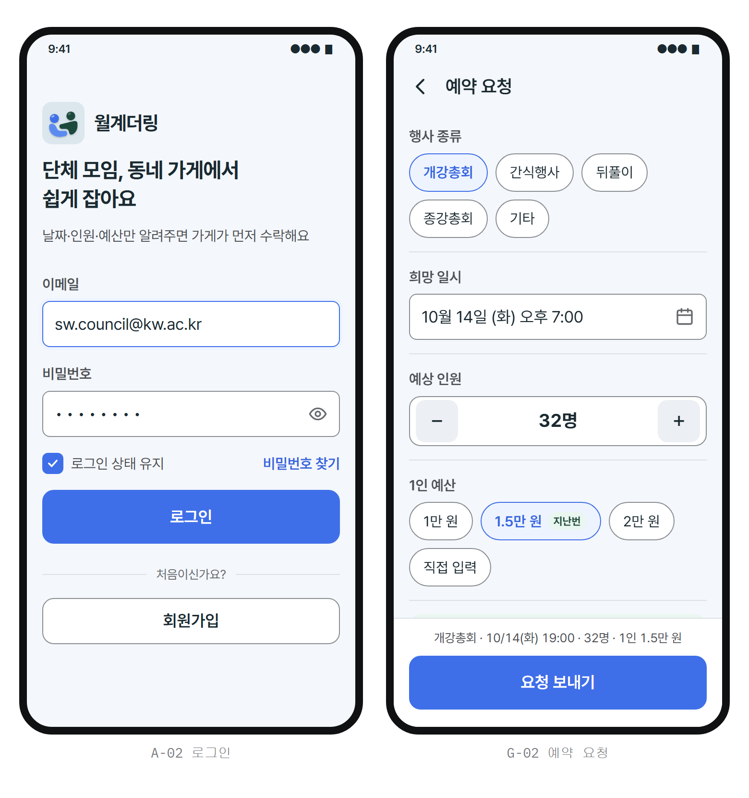

# UI 작업 인계 폴더 (강현 님 → 시작은 여기부터)

월계더링 UI를 만드는 데 필요한 자료를 **이 폴더 하나에** 모았습니다. 이 폴더만 보고 작업할 수 있게 하는 것이 목표예요.
바이브코딩으로 작업한다면 [`PROMPT.md`](PROMPT.md) 의 프롬프트를 그대로 붙여 넣으면 됩니다.

| | |
|---|---|
| 정리 | FE 이원우 (UX·휴리스틱 평가) |
| UI 담당 | FE·UI 강현 |
| 최종 갱신 | 2026-10-04 |
| 질문 | 이 폴더 문서에 관한 건 GitHub 이슈나 PR 댓글로 `@windstar1478` |

---

## 1. 작업 흐름

| 단계 | 담당 | 할 일 | 결과물 | 기한 (제안) |
|---|---|---|---|---|
| 1 | 이원우 | 사전 자료: 예시 화면, 디자인 토큰·컴포넌트, IA·콘텐츠 인벤토리·상태 정의, 페르소나 | **이 폴더** | ✅ 10/4 |
| **2** | **강현** | **UI 초안 4~5개** (같은 화면 3개를 서로 다른 방향으로) | `drafts/` 에 초안별 HTML + PR | **10/5(월) 21시** |
| 3 | 팀 | 초안 중 하나 선택 | PR 댓글로 결정 → 결정 기록 [#13](https://github.com/2026-KW-HACKATHON/14_Kangcompany/issues/13) | 10/5 밤 |
| 4 | 강현 | 선택한 방향으로 전체 페이지 제작 | `wolgyedeoring-frontend/` (React + Vite) | 10/7 |
| 5 | 이원우 → 강현 | 휴리스틱 평가 → 피드백 → 수정 (반복) | 평가 이슈 | 10/7~8 |

최종발표 10/9, 전시회 10/11~13.

---

## 2. 지금 할 일: UI 초안 4~5개 (2단계)

### 왜 초안이 필요한가

[`example/`](example/) 의 예시 화면(컬러 실험실 17번)은 **색과 토큰이 실제로 어떻게 보이는지 확인하려고** 만든 것이에요. 레이아웃·위계·밀도는 아직 다듬지 않았어요. 그래서 UI 방향을 여러 개 받아 비교하려고 합니다.



### 초안마다 만들 화면 (3개 고정)

| 화면 | 누구 | 왜 이 화면인가 |
|---|---|---|
| **G-02 예약 요청 작성** | 단체 (김서연) | 입력이 가장 많은 화면. 입력칸·칩·스테퍼·주요 버튼이 다 나옴 |
| **G-06 예약 상세 — "결제 대기" 상태** | 단체 (김서연) | 상태·금액·다음 행동이 한 화면에. "수락 ≠ 확정"을 보여줘야 함 |
| **S-03 요청 상세·수락** | 사장님 (박정호) | 고령 사용자가 한 손으로 빠르게 판단·수락하는 화면 |

화면별로 들어갈 내용은 [콘텐츠 인벤토리](ia/content-inventory.md)의 같은 ID 항목, 상태 이름·다음 할 일은 [상태 정의도](ia/state-definitions.md), 문구는 [페르소나 문구 예시](personas.md#화면-문구-예시)를 쓰세요. 예시 데이터는 [페르소나 6장 시연 시나리오](personas.md#6-데모-계정과-발표-시연) (고기굽는집, 24명, 1인 2.5만 원 등).

### 초안끼리 달라야 하는 것 / 같아야 하는 것

| 자유롭게 바꿔도 됨 (초안마다 다르게) | 모든 초안에서 같아야 함 ⛔ |
|---|---|
| 레이아웃·정보 묶는 방식 (카드형, 리스트형, 단계형 등) | 색은 [`tokens.css`](design/tokens.css) 토큰만 (포인트 블루 `#3F6FE8`, 보조 포레스트 `#1E4A3A`) |
| 모서리·그림자·선·여백·밀도 | 본문 17px 이상, 탭 영역 48px 이상, 글자 대비 4.5:1 |
| 타이포 위계 (무엇을 크게) | 정보 순서: 날짜·시간 → 인원 → 예산 → 상태 → 다음 행동 |
| 아이콘 스타일, 일러스트 유무 | 브랜드 채움 버튼 화면당 1개, 수락·거절 버튼 붙이지 않기 |
| 상단 영역·진행 표시 방식 | 상태 라벨은 상태 정의도 그대로 |

참고용 방향 예 (꼭 이대로일 필요 없음): ① 지금 예시를 다듬은 **기본형** ② 큰 숫자·큰 버튼 중심의 **고대비 단순형** ③ 카드를 쌓는 **카드형** ④ 단계를 나눈 **스텝형** ⑤ 정보 밀도가 높은 **리스트형**

### 제출 방법

```
docs/ui-handoff/drafts/
  draft-a/index.html   ← 화면 3개를 한 페이지에 나란히 (375px 폭 폰 프레임)
  draft-b/index.html
  ...
```

- 각 HTML은 `<link rel="stylesheet" href="../../design/tokens.css">` 로 토큰을 불러오고, 맨 위에 **초안 이름 + 한 줄 콘셉트**를 적어 주세요.
- 브랜치 `design/ui-drafts` → PR, 리뷰어 `windstar1478`. PR 본문에 초안별 스크린샷 1장씩.
- 큰 글씨 모드(`<html data-font-size="large">`)로 한 번 열어 깨지지 않는지 확인해 주세요.

---

## 3. 폴더 구성과 읽는 순서

| 순서 | 파일 | 내용 | 언제 보나 |
|---|---|---|---|
| 1 | [`personas.md`](personas.md) | 사용자 4명, 디자인 기준, **화면 문구 예시** | 처음에 "한눈에 보기" 표만 |
| 2 | [`example/`](example/) | 17번 예시 화면 (A-02 로그인, G-02 예약 요청) | 처음에 |
| 3 | [`design/design-tokens.md`](design/design-tokens.md) | 토큰 원칙·색·타이포·간격·모션 규칙 | 작업 전 |
| 4 | [`design/components.md`](design/components.md) | 버튼·입력칸·칩·배지·카드·바텀시트·하단 탭의 **상태별 토큰** | 작업하면서 |
| 5 | [`design/tokens.css`](design/tokens.css) | 실제 값 (CSS 변수) — **코드에서는 이것만 import** | 코드에 |
| 6 | [`ia/IA.md`](ia/IA.md) | 화면 35개 ID, 사이트맵, 내비게이션, 핵심 흐름 | 전체 페이지 단계(4)에서 |
| 7 | [`ia/content-inventory.md`](ia/content-inventory.md) | 화면별로 들어갈 내용·데이터 출처·없는 데이터 | 화면 만들 때 |
| 8 | [`ia/state-definitions.md`](ia/state-definitions.md) | 예약·요청·결제·영수증 상태 이름, 배지 톤, 상태별 가능한 행동 | 상태가 나오는 화면 |
| — | [`design/tokens-preview.html`](design/tokens-preview.html) | 토큰 미리보기 (브라우저로 열기) | 필요할 때 |
| — | [`design/palette-playground.html`](design/palette-playground.html) | 컬러 실험실 (17번이 확정) | 필요할 때 |
| — | [`design/assets/app-icon/`](design/assets/app-icon/) | 앱 아이콘 최종본 (SVG, 1024 PNG) | 로고·파비콘 |

### 문서끼리 다를 때

**상태 정의도 > IA > 콘텐츠 인벤토리 > 페르소나 > 기획 문서** 순으로 따릅니다.
특히 `docs/planning/기능명세서` 2.1("복수 가게 수락 및 단체 선택 확정")은 예전 흐름이에요. 지금은 **가장 먼저 수락한 가게로 바로 확정(결제 대기)** 되고, 단체가 가게를 고르는 화면은 없습니다.

---

## 4. 아직 안 정해진 것 (초안에서는 가정해도 됨)

| 항목 | 이슈 | 초안에서는 |
|---|---|---|
| 하단 탭 구성, 지도 서비스 | [#8](https://github.com/2026-KW-HACKATHON/14_Kangcompany/issues/8) | IA 3장 제안대로 (단체: 홈·예약·가게 찾기·내 정보) |
| 조건 수정 요청 주체 | [#3](https://github.com/2026-KW-HACKATHON/14_Kangcompany/issues/3) | G-06에 버튼 자리만 |
| 취소·환불 규정 문구 | [#10](https://github.com/2026-KW-HACKATHON/14_Kangcompany/issues/10) B-08 | "취소 규정 보기" 링크 자리만 |
| 가게 전화번호 데이터 | #10 B-02 | 예시 번호 사용 (필수 항목으로 결정됨) |
| 큰 글씨 모드 배율 | #13 | ×1.125 유지. 휴리스틱 평가 때 ×1.25와 비교해 정함 |

지금까지 확정된 결정은 [#13](https://github.com/2026-KW-HACKATHON/14_Kangcompany/issues/13)에 모여 있어요.
