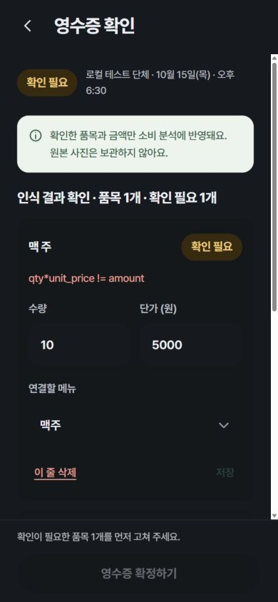
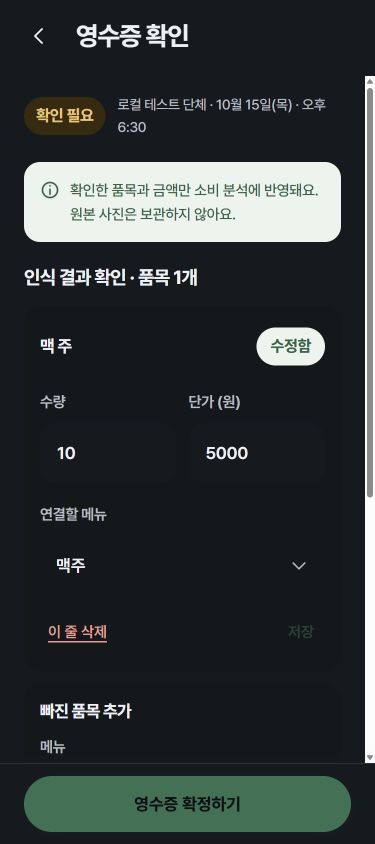
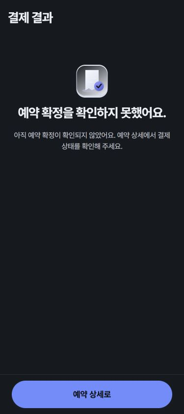

# 10/8 기능 점검 오류 수정 및 검증

대상: 실제 React 앱과 백엔드. 기존 디자인 토큰은 유지했다. 테스트 데이터만 사용했으며 운영 DB·결제·사진 인식 서비스는 호출하지 않았다.

| 점검 ID | 수정 동작 |
|---|---|
| R01 | 확인이 필요한 품목은 값이 같아도 저장 가능. 수량×단가로 금액을 보정하며 오류 안내는 한국어로 표시 |
| R02 | 미저장 변경/추가 품목이 있으면 확정 불가. 저장·변경 후 확인 체크를 다시 받음 |
| R03 | 품목 추가 실패 시 입력 유지, 성공 후에만 초기화 |
| R04 | 품목이 0개이면 확정 불가 |
| P01 | URL의 test/zero 값만으로 확정 표시하지 않음. 승인 후 서버 예약 상태 조회, 확정 상태에서만 성공 표시. StrictMode 중복 승인 방지 |
| S01 | publish_slots RPC가 모든 일정을 한 트랜잭션으로 공개. 재시도 키를 유지하고 같은 키·같은 조건은 기존 결과 반환 |
| S02 | 화면·서버 모두 과거 시작 시간의 공개/재공개 차단 |
| Q01 | 만료 요청을 다시 작성할 때 원래 KST 시간 유지 |
| V01 | 예약 인원·수량·금액의 정수/범위 검사. 공통 수량 입력은 정수로 보정 |
| C01 | 사용자가 선택한 정책대로 참석 응답 중에는 예약 인원을 유지하고 마감할 때만 반영. 모집 인원 expected_headcount로 참석률·미응답 계산 |
| C02 | 참석 0명 마감은 기존 예약 인원 유지 안내. 마감 재시도 시 중복 알림 방지 |
| C03 | 계좌이체 선택은 SDK TRANSFER, 카드 선택은 CARD로 전달 |

기존 요청으로 수정해 둔 시작 화면 헤더도 포함했다. 상단 월계더링 글자만 숨기고 헤더 높이·여백은 유지한다.

## 최초 단독 브랜치 검증 (통합 전)

- FE `npm run test:local`: **82개 통과**. 실제 라우터·화면 + 격리된 가짜 API. 실패/저장/재시도/잘못된 숫자/상태 오표시와 기존 25개 경로 렌더링·접근 가드 등.
- BE `pnpm test`: **37개 통과**. 기존 순수 함수 32개 + 새 메모리 PostgreSQL 검사 5개.
- PGlite에 실제 당시 001~010 마이그레이션을 순서대로 적용했다. 인증 UID/역할은 로컬로 구성했다. 일괄 공개 롤백·재시도·authenticated 호출·anon 접근 거절·과거 시각 보호·RSVP 응답/수정/삭제/마감 SQL을 직접 실행했다.
- TypeScript 검사와 프로덕션 빌드 통과. 기존 500KB 번들 경고는 남아 있다.
- 375×844 브라우저 화면에서 기존 영수증 값 저장 → 확인 체크 → 확정 버튼 활성화 및 미결제 예약의 성공 표시 차단을 직접 확인했다.
- `.github/workflows/local-regressions.yml`에서 동일한 로컬 FE/BE 검사와 FE 빌드를 실행한다.

## 화면 증거 (모두 로컬 가짜 데이터)

| 수정 전 | 수정 후 |
|---|---|
|  |  |

## 적용 순서와 확인할 것

1. 백엔드 담당자가 `012_functional_audit.sql`을 010 소셜 로그인·011 추가 입력 칸 이후 **한 번만** 적용한다.
2. `scripts/check_migrations.sql`로 확인한다. 새 RPC/컬럼이 필요한 프런트보다 DB를 먼저 적용한다.
3. 프런트를 배포한다. 운영 Supabase 인증/RLS/Realtime·Toss 테스트 결제창·OCR 서비스·실제 iPhone Safari 검증은 별도로 한다.

과거 응답으로 이미 덮인 모집 인원은 자동 복원하지 않는다. 012 적용 시 기존 조사는 현재 예약 인원으로 모집 인원을 초기화한다. 실제 원래 인원을 알고 있다면 백엔드 담당자가 확인 후 별도 보정해야 한다.

PR #20·#21 통합 후의 검증 및 최소 인원 마감 정책은 [통합 검증 기록](../pr20-21-integration-2026-10-08/README.md)을 참고하세요. 기존 010_functional_audit는 미배포 파일이어서 012로 번호를 정리했습니다.
